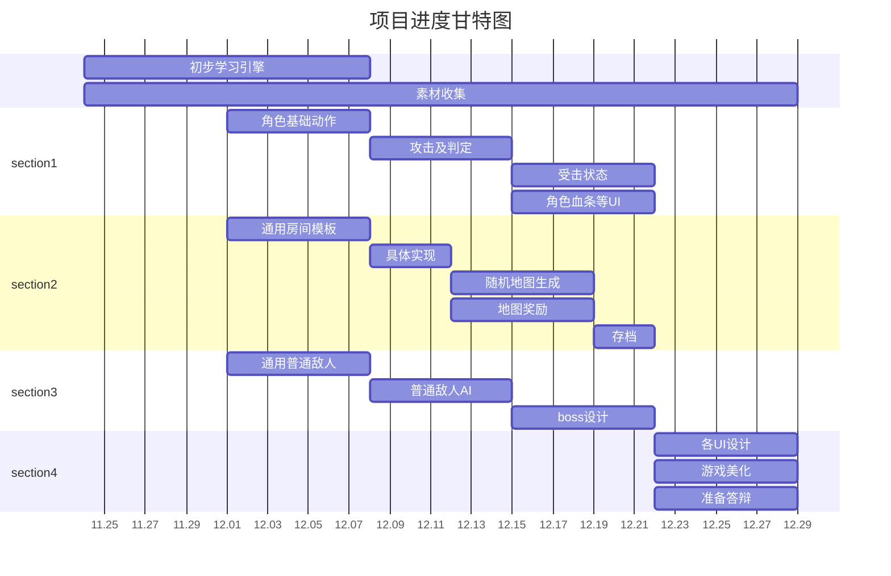

# 破碎之塔
使用**Cocos2d-x**开发的类重生细胞2d平台动作游戏。  
操纵主角在未知的高塔中探索，发现藏于其中的秘密，每一次的死亡都会让你的角色变得更强！
游戏正在开发中……
> 该项目为大学课程项目
## 开发环境
- Windows11
- Cocos2d-x-4.0
- Microsoft C++ (MSVC)
## 开发计划
1. 角色系统
   - [ ] 主角基本的移动、攻击等能力
   - [ ] 基础动作（行走，奔跑，跳跃，闪避）
   - [ ] 基础攻击（多段攻击）
   - [ ] 特殊攻击
   - [ ] 基础状态切换（Idle / 攻击 / 受击 / 死亡）
   - [ ] 主角/敌人生命值
   - [ ] 受击硬直反馈
   - [ ] 普通攻击和特殊攻击
   - [ ] 战斗判定
2. 敌人与 Boss
   - [ ] 不少于3种普通怪物
   - [ ] 不少于1个Boss
   - [ ] 敌人AI
3. 地图
   - [ ] 普通敌人房间
   - [ ] 精英/boss房间
   - [ ] 奖励房间
   - [ ] 将多个房间连为地图
   - [ ] 背景音乐
4. Roguelike元素
   - [ ] 地图中的房间随机生成
   - [ ] 怪物随机生成
   - [ ] 奖励按一定概率随机出现
   - [ ] 每次死亡丢失所有进度，但保留部分资源解锁永久升级
5. UI功能
   - [ ] 标题菜单
   - [ ] 玩家血条
   - [ ] 技能冷却
   - [ ] 敌人血条
   - [ ] 死亡重开
   - [ ] 暂停/继续菜单
6. 存档功能
   - [ ] 保存玩家名称
   - [ ] 保存玩家玩过的游戏数据和每局游戏的得分
   - [ ] 保存局外积累的资源和解锁的升级
   - [ ] 支持导入/导出存档
7. 其他
   - [ ] 奖励系统（药水，道具）
   - [ ] 武器和技能系统
   - [ ] 剧情系统
   - [ ] ……
## 项目分工
| Github用户名 | 分工           |
| :----------- | :------------- |
| @l-library   | 角色系统       |
| @cardiest    | 敌人和boss设计 |
| @Creeperwww  | 房间设计       |
## 项目进度时间线

## 类的设计和继承关系
## 游戏展示
## 下载
> 游戏正在开发中……
## 致谢
- *第三方库致谢*